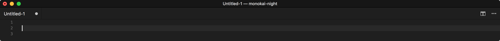
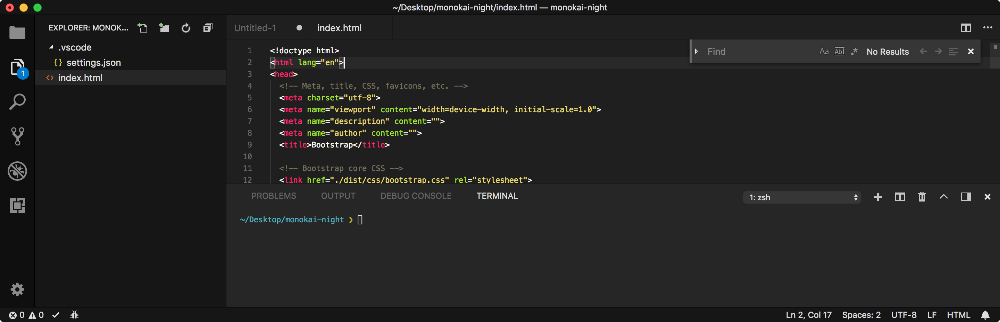

# Monokai Dark by Mathieu42

<p align="center">
  
</p>

A complete, dark and minimalistic Monokai-inspired color theme for [Visual Studio Code](https://code.visualstudio.com) and [Cursor](https://cursor.com).

By [Mathieu Lopes](https://www.mathieu42.com) ([Mathieu42](https://www.mathieu42.com)).

## Features

- **Complete** — Broad UI coverage, including chat, inline edits, and sticky scroll.
- **Dark** — Darker than classic Monokai; grayscale base with selective accent colors.
- **Minimal** — Fewer visual borders; calm contrast for long coding sessions.

## Installation

### Marketplace

Search for **Monokai Dark by Mathieu42** (publisher: **mathieu42**).

### VSIX

Download a `.vsix` from [GitHub Releases](https://github.com/MathieuLopes/vscode-monokai-dark-by-mathieu42/releases), then **Extensions: Install from VSIX…**.

### From source

```bash
git clone https://github.com/MathieuLopes/vscode-monokai-dark-by-mathieu42.git
cd vscode-monokai-dark-by-mathieu42
npm run dev
```

Requires the `cursor` or `code` CLI on your PATH.

## Usage

**Preferences: Color Theme** → **Monokai Dark by Mathieu42**

## Screenshots





## Links

- Website: [mathieu42.com](https://www.mathieu42.com)
- Repository: [vscode-monokai-dark-by-mathieu42](https://github.com/MathieuLopes/vscode-monokai-dark-by-mathieu42)

## License

MIT — see [license](license).
